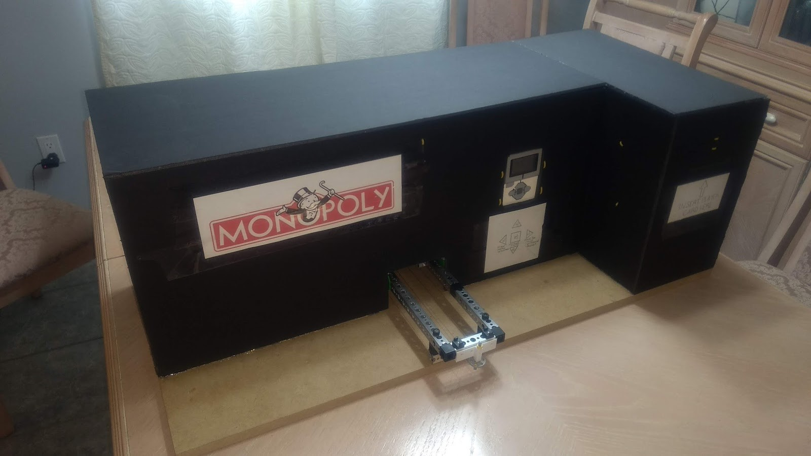
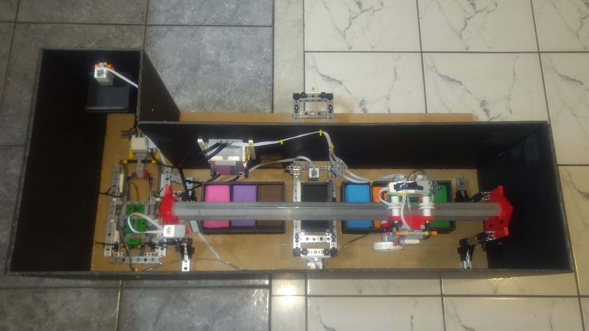

# MonopolyATM
MTE 100 Final Project

This project is a four person final summative project for 1A mechatronics engineering at the University of Waterloo.

Overview

In the game of Monopoly, the objective is to amass the highest amount of money possible, while bankrupting any opponents. Unfortunately, it is straightforward to cheat the financial system of the game, and therefore a need exists for a way to better manage the game’s money. The proposed solution is an Automated Teller Machine (ATM) that would store players’ money and allow players to complete the necessary transactions for the game’s completion.

Mechanical Design

In order to fulfill the functionality described in the project scope, the final design was a cartesian based, pick and place electromechanical system. It primarily consisted of a gantry, carriage, end effector, pneumatic system, and money input and output system. The final design had other secondary components that were required for the housing of bills, overall enclosement of the system, and user interface.

Overall Assembly

Pneumatic Housing

Carraige Implementation

Software Design

The Monopoly banking system was expected to be a large code file due to the range of available functions offered. Every user action had to be checked to ensure they weren’t breaking any rules. As well, a friendly user interface had to be implemented for ease of use.
It was decided that the program would be function based due to having such a broad base of tasks to complete, and the RobotC programming language does not support class data types. The software was coded in a hierarchy of functions, where each main task had its own master function, which called a series of smaller functions to complete subtasks in a task. 
The program is coded in a hierarchy style: each function calls smaller functions until reaching a trivial function, where a calculation is performed, input from the user is converted to data, or the robot makes a mechanical movement

The codebase can be found in github in the [MainCode.c](https://github.com/wshahbaz/MonopolyATM/blob/master/MainCode.c) file or [here](https://github.com/wshahbaz/MonopolyATM/blob/master/MainCode.c)

